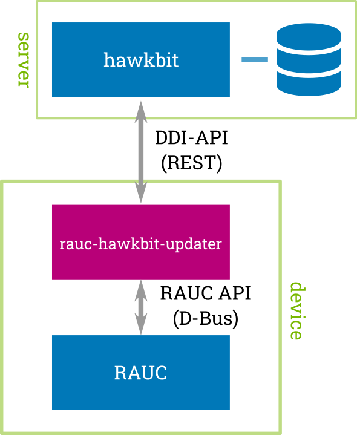

.. RAUC hawkBit Updater documentation master file, created by
   sphinx-quickstart on Thu Feb  4 07:40:09 2021.
   You can adapt this file completely to your liking, but it should at least
   contain the root `toctree` directive.

Welcome to RAUC hawkBit Updater's documentation!
================================================

.. toctree::
   :glob:
   :numbered:
   :maxdepth: 1

   using
   reference
   contributing
   changes

The RAUC hawkBit updater is a simple commandline tool / daemon written in C (glib).
The daemon runs on your target and operates as an interface between the
`RAUC D-Bus API <https://github.com/rauc/rauc>`_
and the `hawkBit DDI API <https://github.com/eclipse/hawkbit>`_.

